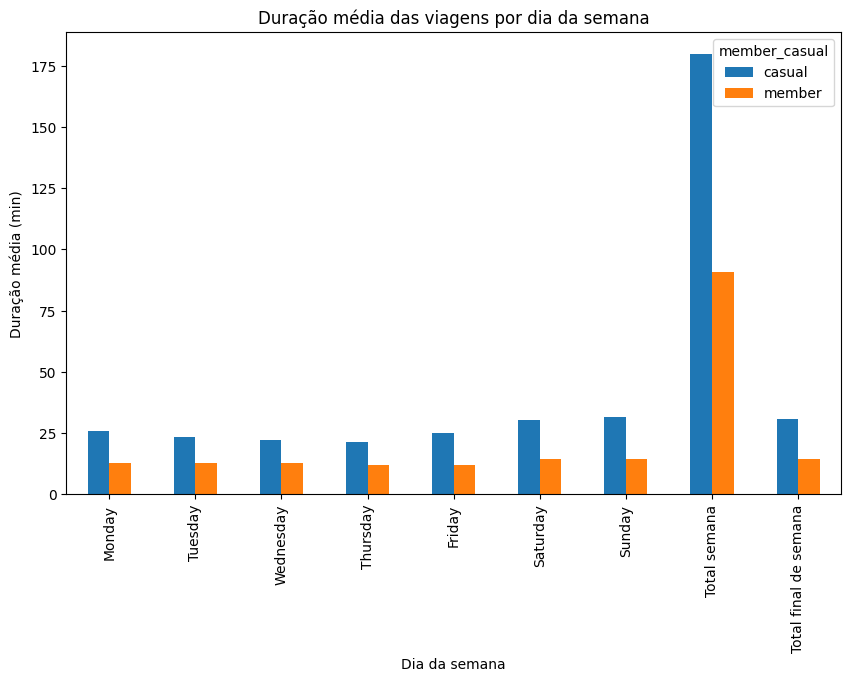

# Cyclistic Case Study


> **Este projeto foi desenvolvido como Trabalho de Conclusão de Curso (TCC) no programa Google Data Analytics.**

## Visão Geral do Projeto
Este projeto explora dados reais de uso de bicicletas compartilhadas para propor ações estratégicas que aumentem a receita recorrente da Cyclistic, utilizando análise de dados avançada e visualizações impactantes.

Este estudo de caso foi desenvolvido para analisar padrões de uso das bicicletas compartilhadas da Cyclistic, com o objetivo de identificar diferenças de comportamento entre membros anuais e usuários casuais. A partir dos insights obtidos, são propostas estratégias de marketing para aumentar a conversão de usuários casuais em membros anuais, promovendo o crescimento sustentável do serviço.

O projeto segue as etapas do ciclo analítico:  
**Ask → Prepare → Process → Analyze → Share → Act**

---

## Instruções para Reproduzir a Análise

1. **Obtenha os Dados**
   - Baixe os arquivos de dados mensais do repositório público da Cyclistic (Motivate International Inc.).  
   - Os dados não estão incluídos neste repositório por questões de licença.  
   - Consulte a pasta `dados/README.txt` para instruções detalhadas de download.

3. **Execução das Etapas**
   - Acesse os notebooks na pasta `notebooks/`:
     - `01_Process.ipynb`: Limpeza e preparação dos dados.
     - `02_Analyze.ipynb`, `03_Share`: Análise exploratória, visualizações e insights.
   - Siga as instruções nos próprios notebooks para carregar e processar os dados.
   - **Dica:** Se preferir evitar erros de dependência entre os notebooks, junte todas as etapas em um único notebook sequencial.

4. **Resultados**
   - As principais visualizações podem ser encontradas na pasta `imagens/`.
   - O relatório final está na pasta `relatorio/`.

---

## Principais Conclusões

- **Usuários casuais** fazem viagens significativamente mais longas, especialmente nos finais de semana, indicando perfil de lazer e turismo.
- **Membros anuais** realizam mais viagens, com duração menor e uso predominante durante a semana, sugerindo deslocamento diário (commute).
- Ambos os grupos utilizam tanto bicicletas elétricas quanto clássicas, mas há baixa adesão às scooters.
- Recomendações estratégicas incluem:  
  - Campanhas de marketing direcionadas para casuais aos finais de semana.
  - Incentivos para membros focados em deslocamento diário.
  - Comunicação personalizada para aumentar conversão de planos.

---

## Ferramentas Usadas
- Python
- Pandas
- Matplotlib
- Jupyter
---

## Estrutura do Repositório

```
cyclistic-case-study/
│
├── README.md
├── dados/
│   └── README.txt
├── notebooks/
├── imagens/
└── relatorio/
```

---

**Autor:** Wescley Souza  
**Contato:** https://www.linkedin.com/in/wescleysouzas/

---
